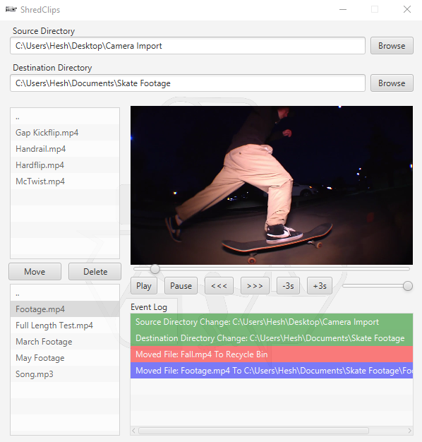

<h1 align="center">
        <a>ShredClips</a>
</h1>

A convenient media player made for content creators, by a content creator

        

## Features

* [x] Simplistic user interface and media player with lightning fast video and image load times
* [x] Built in directory and file organizer to quickly decipher what content stays and what goes
* [x] Event log to track directory changes, moving, and deleting

### Features to come

* Standalone executable
* Further video file format support (.mov, .mts, .wmv, .avi, .flv)
* Audio file format support
* Directory file format .ico display

## Running Locally
### Requirements
* Windows OS
* <a href="https://www.jetbrains.com/idea/download/#section=windows" target="_blank">IntelliJ IDEA</a>
* <a href="https://www.oracle.com/java/technologies/downloads/" target="_blank">Java JDK 9 (or greater)</a>
* <a href="https://gluonhq.com/products/javafx/" target="_blank">JavaFX Windows SDK</a>

### Instructions
1. Clone repository and open in IntelliJ
2. Add JavaFX SDK library: File -> Project Structure -> Libraries -> + -> Java -> \path\to\javafx-sdk-15.0.1\lib
3. Add below VM options: Run -> Edit Configurations -> VM options
~~~~
--module-path "\path\to\javafx-sdk-15.0.1\lib" --add-modules=javafx.controls,javafx.fxml,javafx.media
~~~~
